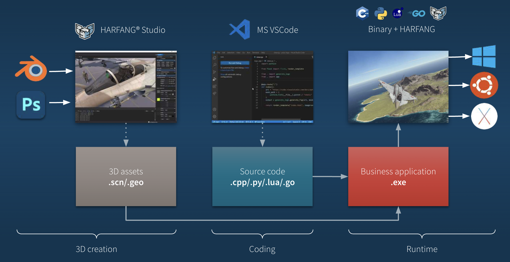

# Functional Specifications 

2023 Project Harfang3D Binding Group 1  
Created on: 2023-04-01  
Author: [Rémy Charles](https://github.com/RemyCHARLES)

| Role | Name | 
| :--- | :--- |
| Project Manager | [Elise Gautier](https://github.com/elisegtr) |
| Program Manager | [Rémy Charles](https://github.com/RemyCHARLES) |
| Tech Lead | [Nicolas Mida](https://github.com/Nicolas-Mida) | 
| Software Engineer | [Grégory Pagnoux](https://github.com/Gregory-Pagnoux) |  
| Quality Assurance | [Théo Trouvé](https://github.com/TheoTr) | 

 

___

Table of Contents

- [Functional Specifications](#functional-specifications)
  - [1. Introduction](#1-introduction)
    - [1.1 Purpose](#11-purpose)
    - [1.2 Project Scope](#12-project-scope)
    - [1.3 Related documents](#13-related-documents)
    - [1.4 Terms/ Acronyms and Definitions](#14-terms-acronyms-and-definitions)
    - [1.5 Risk and Assumptions](#15-risk-and-assumptions)
  - [2. System/ Solution Overview](#2-system-solution-overview)
    - [2.1 Context Diagram](#21-context-diagram)
    - [2.2 System Actors](#22-system-actors)
    - [2.3 Dependencies and Change Impacts](#23-dependencies-and-change-impacts)
  - [3. Functional Specifications](#3-functional-specifications)
    - [3.1 Binding F# for HARFANG® 3D](#31-binding-f-for-harfang-3d)
  - [4. Other System Requirements/ Non Functional Requirements](#4-other-system-requirements-non-functional-requirements)
  - [6. Integration Requirements](#6-integration-requirements)
    - [6.1 Exception Handling/ Error Reporting](#61-exception-handling-error-reporting)
  - [7. References](#7-references)
  - [8. Open Issues](#8-open-issues)
  

___

 

## 1. Introduction 

 

### 1.1 Purpose 

[HARFANG® 3D](https://www.harfang3d.com/en_US/) is a 3D engine that allows you to create 3D games and applications. It is a cross-platform engine that can be used on Win32, Win64 Intel, Linux 64 Intel and Aarch 64 ARM . It is written in **C++** and uses OpenGL for rendering. It is also compatible with Vulkan and DirectX 11.

Based on the information provided, it appears that the purpose of developing another 3D engine, **HARFANG® 3D** is to meet the specific technical, sovereignty, and long-term requirements of the civil and defense industries. These industries have strong technical requirements such as safety certification and custom hardware, as well as a need for confidentiality and the ability to run offline.

 

**Company distribution**

| Person | Company role | Contact |
| :-: | :-: | :-: |
| [François Gutherz](https://www.linkedin.com/in/astrofra/) | CTO & Project leader | francois.gutherz@harfang3d.com|
| [Emmanuel Julien](https://www.linkedin.com/in/ejulien/) | Lead developer | emmanuel.julien@harfang3d.com|

 

### 1.2 Project Scope

   - Create Bindings for the **HARFANG® 3D** engine  
   - Provide a **set of tools** and **documentation** that make it easy for **F#** developers to incorporate **HARFANG® 3D** into their projects.

 

### 1.3 Related documents

| Document | Description |
| :--- | :--- |
| [Critical Path](/Critical%20Path/Critical_Path.md) | Project schedule |
| [Test Plan](/Test%20Plan/Test_Plan.md) | Test plan |
| [Technical Specifications](/Documents%20Specifications/Technical_Specification.md) | Technical specifications |
| [Trello](https://trello.com/b/B7eB7vfa/f) | Trello board |

 

### 1.4 Terms/ Acronyms and Definitions

| Term | Definition |
| :--- | :--- |
| **HARFANG® 3D** | 3D engine that allows you to create 3D games and applications. |
| **FABgen** | Generator of bindings for the C++ engine HARFANG® 3D. |
| **F#** | Functional programming language. |
| **lua** | Scripting language. |
| **C++** | Object-oriented programming language. |
| **Python** | Interpreted, high-level, general-purpose programming language. |
| **OpenGL** | Cross-platform API for rendering 2D and 3D graphics. |
| **Vulkan** | Cross-platform API for rendering 2D and 3D graphics. |
| **DirectX 11** | Cross-platform API for rendering 2D and 3D graphics. |

 

### 1.5 Risk and Assumptions

- If we forget to create a binding for a function, it will not be possible to use it in F#.

 

___

## 2. System/ Solution Overview

 

### 2.1 Context Diagram 

 

### 2.2 System Actors

| User | Example | Frequency of use | Security/ Access, Features Used | Additional Comments |
| :--- | :--- | :--- | :--- | :--- |
| **F# developer** |  | - | - | - | 

 

### 2.3 Dependencies and Change Impacts

  - #### 2.3.1 System Dependencies
      
       The proposed solution will not depend on any other system because it is   not mandatory for the proper functioning of Harfang3D or other systems.

 

  - #### 2.3.2 Change Impacts

    - **HARFANG® 3D** : 3D engine that allows you to create 3D games and applications.
    - **FABgen** : Generator of bindings for the C++ engine HARFANG® 3D.
     - **OpenGL** : Cross-platform API for rendering 2D and 3D graphics.
     - **Vulkan** : Cross-platform API for rendering 2D and 3D graphics.
     - **DirectX 11** : Cross-platform API for rendering 2D and 3D graphics.

 

___

## 3. Functional Specifications

### 3.1 Binding F# for HARFANG® 3D

  - #### 3.1.1 Purpose/ Description

    The purpose of this section is to create the binding of the **HARFANG® 3D** engine in **F#**. The **HARFANG® 3D** engine is a 3D engine that allows you to create 3D games and applications. For that we will use the **FABgen** generator. This generator is written in **Python** and is used to generate the bindings for the **C++** engine, and it already got bindings in C#/Lua/Python/GoLang. 

   

  - #### 3.1.2 Uses Cases

  | UC-1 | Create a binding for the HARFANG® 3D engine in F#. |
  | --- | --- |
  | **Primary Actor** | F# developer |
  | **Stakeholders and Interests** | - |
  | **Trigger** | The F# developer wants to use the HARFANG® 3D engine in F#. |
  | **Preconditions** | The F# developer has the HARFANG® 3D engine installed on his computer. |
  | **Postconditions** | The F# developer can use the HARFANG® 3D engine in F#. |
  | **Main success scenario** | 1. The F# developer uses the FABgen generator to create the binding.   2. The F# developer can use the HARFANG® 3D engine in F#. |
  | **Extensions** | - |
  | **Special Requirements** | - |
  | **Open Questions** | - |
  
   

  | UC-2 | Create a set of tools and documentation that make it easy for F# developers to incorporate HARFANG® 3D into their projects. |
  | --- | --- |
  | **Primary Actor** | F# developer |
  | **Stakeholders and Interests** | - |
  | **Trigger** | The F# developer wants to use the HARFANG® 3D engine in F#. |
  | **Preconditions** | The F# developer has the HARFANG® 3D engine installed on his computer. |
  | **Postconditions** | The F# developer can use the HARFANG® 3D engine in F#. |
  | **Main success scenario** | 1. The F# developer uses the FABgen generator to create the binding.   2. The F# developer can use the HARFANG® 3D engine in F#. |
  | **Extensions** | - |
  | **Special Requirements** | - |
  | **Open Questions** | - |

   

  - #### 3.1.3 Mock-up

 
F# are not mentioned in the schema but that will work the same way as the other languages.

 

  - #### 3.1.4 Functional Requirements

| ID | Description | Priority | Status |
| :--- | :--- | :--- | :--- |
| FR-1 | The F# developer can use the HARFANG® 3D engine in F#. | 1 | To do |
| FR-2 | Have a document to explain how to use the F# bindings | 2 | To do |

  - #### 3.1.5 Field level Specifications

| ID | Description | Priority | Status |
| :--- | :--- | :--- | :--- |
| FLS-1 | The F# developer can use the HARFANG® 3D engine in F#. | 1 | To do |
| FLS-2 | Have a document to explain how to use the F# bindings | 2 | To do |

  - #### 3.1.6 Personas

| Name | Age | Role |Description | 
| :--- | :--- | :--- | :--- |
| Mathias Durant | 38 |F# developer | The F# developer wants to use the HARFANG® 3D engine in F# to create a simulation 3D in Virtual Reality (VR) to know which is most likely to attract the attention of a passer-by on the street. | 
| Pierre-Étienne Morency | 23 | Computer Science Student | He is a students who need to use the HARFRANG® 3D engine in F# to create a reproduction of his school in VR. |
| Jean-Philippe Lavoie | 48 | Software Engineer | He is a software engineer who needs to use the HARFRANG® 3D engine in F# to create a AR system for this car company. | 
| Marie-Ève Lavoie | 25 | Entrepreneur | She is a young entrepreneur who wants to have a 3D visualization of her final product and thanks to some knowledge in F#, she uses HARFRANG® 3D. |

___

## 4. Other System Requirements/ Non Functional Requirements

<!-- Todo -->

___

## 6. Integration Requirements

### 6.1 Exception Handling/ Error Reporting

See the [Test Plan](/Test%20Plan/Test_Plan.md) or the [Critical Path](/Critical%20Path/Critical_Path.md)

___

## 7. References

| ID | Description | URL |
| :--- | :--- | :--- |
| 1 | HARFANG® 3D | [Link](https://www.harfang3d.com/en_US/) |
| 2 | FABgen | [Link](https://github.com/ejulien/FABGen) |

___

## 8. Open Issues

<!-- Todo -->
