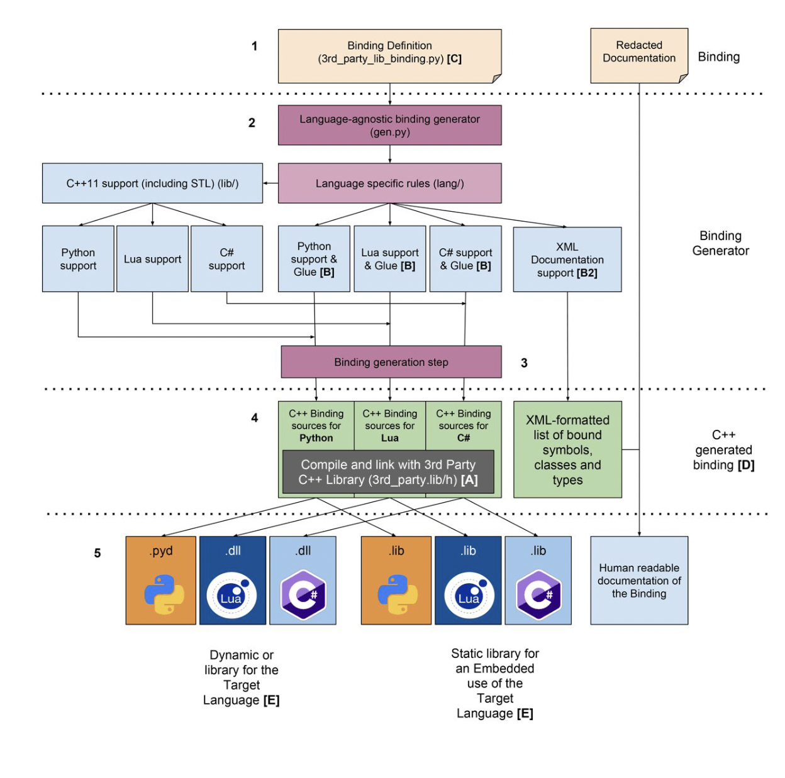

# Technical Specifications


<details><summary><b>Table of Contents</b></summary>

- [Technical Specifications](#technical-specifications)
- [1. Purpose of the document](#1-purpose-of-the-document)
- [2. Introduction of the project](#2-introduction-of-the-project)
  - [a. Context](#a-context)
  - [b. Goal of the project](#b-goal-of-the-project)
  - [c. General Description](#c-general-description)
  - [d. Team Members](#d-team-members)
- [3. Solution](#3-solution)
  - [a. Existing Solutions](#a-existing-solutions)
  - [b. Current Solution](#b-current-solution)
  - [c. Proposed Solution](#c-proposed-solution)
- [4. Process (Vector example)](#4-process-vector-example)
  - [a. How is it working ?](#a-how-is-it-working-)
  - [b. Vector class](#b-vector-class)
    - [- Structure](#--structure)
    - [- DLL Import Functions](#--dll-import-functions)
    - [- Testing](#--testing)
- [5. Further Considerations](#5-further-considerations)
  - [a. License](#a-license)
  - [b. Cost Estimation](#b-cost-estimation)
  - [c. Security](#c-security)
  - [d. Risks](#d-risks)
  - [e. Accessibility](#e-accessibility)
  - [Types Conversion](#types-conversion)
- [6. Success Evaluation](#6-success-evaluation)
- [7. Folder Structure](#7-folder-structure)
  - [a. Before the project](#a-before-the-project)
  - [b. During the project](#b-during-the-project)
- [8. Ressources](#8-ressources)
  - [a. References](#a-references)
  - [b. Glossary](#b-glossary)
  
</details>


# 1. Purpose of the document


 The Technical Specifications Document (TSD) is a document that describes the technical aspects of the project. It is a document that serves to define the project and to ensure that the project is well understood by both the client and the team members.


&nbsp;
# 2. Introduction of the project

[HARFANG](https://www.harfang3d.com/en_US/framework) is a real-time 3D engine open-source and available on GitHub, developed by [HARFANG3D](https://www.harfang3d.com/en_US/). It is written in C++ and is based on the open-source [bgfx](https://github.com/bkaradzic/bgfx) library supporting Vulkan, Metal, DirectX, OpenGL and OpenGL ES.

## a. Context

[FABGen](https://github.com/ejulien/FABGen/) (a set of Python scripts to generate C++ binding code to different languages) is used to generate binding for HARFANG and currently supports the following target languages: CPython 3.2+, Lua and Go 1.11+. 

For more details, please take a look at the [Functional Specifications](https://github.com/algosup/2022-2023-project-3-harfang3d-binding-Project-1-group/blob/main/Documents%20Specifications/Functional_Specifications.md).
## b. Goal of the project 

The goal of the project is to provide a F# binding for HARFANG.

We have 7 weeks to complete the project.

 ## c. General Description
| Project | Client | Author | Created on | Last update | Document Version |
|:---|:---|:---|:---|:---|:---|
| 2023 Project 3 - Harfang3D Binding Group 1 | [HARFANG3D](https://github.com/harfang3d/harfang3d)  | [Nicolas MIDA](https://github.com/Nicolas-Mida) | 2022-01-03 | 2022-01-20 | V1.0 |
| 2023 Project 3 - Harfang3D Binding Group 1 | [HARFANG3D](https://github.com/harfang3d/harfang3d) | [Nicolas MIDA](https://github.com/Nicolas-Mida) | 2022-01-03 | 2022-02-09 | V2.0 |

&nbsp;
## d. Team Members

| Role | Name |  
|:---|:---|
| Project Manager | [Élise GAUTIER](https://github.com/elisegtr) |
| Tech Lead | [Nicolas MIDA](https://github.com/Nicolas-Mida) |
| Quality Assurance (QA) | [Théo TROUVÉ](https://github.com/TheoTr/) |
| Software Engineer | [Grégory PAGNOUX](https://github.com/Gregory-Pagnoux) |
| Program Manager | [Rémy CHARLES](https://github.com/RemyCHARLES) |

&nbsp;

# 3. Solution

## a. Existing Solutions

SWIG (Simplified Wrapper and Interface Generator) is a software development tool that connects programs written in C and C++ with a variety of high-level programming languages.

However SWIG has different issues 

  - It is a very old and complex codebase. Language support is written partially in C and SWIG interface files 
which are almost a language by themselves. The C codebase does everything through a single 
Object struct hiding the real type of variables making it extremely difficult to debug and extend the 
SWIG core. 
  
  - Uneven feature support between languages with missing features although the target language 
could support them

## b. Current Solution 

FABGen is a set of Python scripts to generate C++ binding code to different languages. It is used to generate binding for HARFANG and currently supports the following target languages: CPython 3.2+, Lua and Go 1.11+.

FABgen tries to solve the issues of SWIG by:

 - Using Python to implement Fabgen and the binding definitions themselves.
 - Implementing as much as possible of the features in a common part of the program (gen.py).

## c. Proposed Solution

As mentioned above, the main goal of the project is to provide a F# binding for HARFANG.

We will use the FABGen project as a base to implement the F# binding.


We need to define what is F# :
  - JIT (Just-In-Time) from IL (Intermediate Language) to native code
  - Statically typed
  - Link to C library (C++ has to be wrapped with C first)


# 4. Process (Vector example)

In this section, we will explain how we will implement the F# binding for the Vector class.

## a. How is it working ?

  To use native C++ code in F#, we need to wrap it with C first. Then, we can use the C wrapper in F#.

  For that we're using CMake to generate a .dylib file for MacOS and the .dll file for Windows. (They are Dynamic Link Libraries)

  WIP

  &nbsp;
## b. Vector class

The Vector Library provides a set of functions for operating on 2-dimensional and 3-dimensional vectors. The library is written in F# and uses interop services to access functions in a shared library written in C.


### - Structure

The library defines two structures, Vector2 and Vector3, to represent 2-dimensional and 3-dimensional vectors, respectively. Both structures contain two or three double-precision floating-point values to represent the x, y, and z components of the vector. The structures are defined using the Struct and StructLayout attributes to specify the memory layout.

&nbsp;
### - DLL Import Functions

The library uses the DLLImport attribute to access functions in a shared library. There are functions for both Vector2 and Vector3 structures, including functions for calculating the distance between two vectors, finding the midpoint between two vectors, finding a specified percentage of the distance between two vectors, and updating the values of a vector

Here is a example of usage of the DLLImport attribute with the distanceToVector2 function :
```fsharp
[<DllImport("libVectors")>]
extern double distanceToVector2(Vector2 vec1, Vector2 v2)
```

This function takes two Vector2 parameters, vec1 and v2, and returns a double value. The DllImport attribute is used to specify the name of the DLL from which to import the function.

Once these functions are imported, they can be called in the code just like any other F# function. For example, the distanceToVector2 function is called later in the code block like this:

```fsharp
let distV2 = distanceToVector2 (vec2_n1, vec2_n2)
```

In this case, vec2_n1 and vec2_n2 are Vector2 values, and the call to distanceToVector2 returns a double value which is stored in the distV2 variable.

### - Testing


# 5. Further Considerations
## a. License

The FABGen software is licensed under the GPLv3 license. That means that we can use it for our project as long as we respect the license terms.

The modifications that we will make to the FABGen project will be published on GitHub under the same license.

## b. Cost Estimation

To make the project, we don't need to buy anything. We will use the tools that we already have.

## c. Security

- The binding generated by FABGen must be tested to ensure that it does not introduce any security vulnerabilities.
  
- The binding should not allow arbitrary memory access, and should properly validate input data to prevent buffer overflow and other types of attacks.

- The binding should also be designed to minimize the attack surface by limiting the number of exposed functions and data structures.

## d. Risks

A lot of risks can occur during the project. We have to be aware of them and try to minimize them as much as possible.

Here are the main risks that we have identified:

- The risk of not being able to generate the F# binding for HARFANG within the 7-week timeframe.  
  --> This risk can be mitigated by dividing the project into several milestones and by using the agile methodology.

- The risk that the binding generated by FABGen may not be fully compatible with all features of the HARFANG engine, leading to unexpected behavior or crashes.  
  --> We are required to test the binding extensively to ensure that it is fully functional.

- The risk that the binding may not be fully compatible with the latest version of F# or HARFANG.  
  --> We have to regularly update the binding to support new versions of the language and the engine.

- Customer dissatisfaction.  
  --> We have to ensure that the binding is fully functional and that it is easy to use.

- Difficulties using the binding.  
  --> We have to provide a clear documentation and examples to help developers use the binding properly.

- Speed issues.  
  --> We have to test the binding to ensure that it is not too slow.


## e. Accessibility

- The binding should be designed to be accessible to developers with varying levels of expertise, with a clear documentation and examples provided.

- The binding should be compatible with the latest version of F# and should be regularly updated to support new versions of the language.

After the project is completed, the binding should be integrated into the FABGen project with some deep testing to ensure that it is fully functional.

## Types Conversion

Here is the following equivalence table between the different types used in the different languages that we will use in the project:

|F# Type	| C Type	| C++ Type |
|---|---|---|
| int | int	 | int |
| bool | _Bool | bool |
| float | float | float |
| double | double | double |
| string | char* | std::string |
| int32 | int32_t | int32_t |
| int64 | int64_t | int64_t |
| uint32 | uint32_t | uint32_t |
| uint64 | uint64_t | uint64_t |
| byte | uint8_t | uint8_t |
| sbyte | int8_t | int8_t |


# 6. Success Evaluation

To ensure that the project is successful, we will have to make the 29 unit tests pass and to test the binding with the HARFANG engine.


# 7. Folder Structure
## a. Before the project

```
├───FABGen-master
│   ├─── .travis
│   ├─── .vscode
│   ├─── examples
│   ├─── lang
│   │     ├─── __init__.py
│   │     ├─── cpython.py
│   │     ├─── go.py
│   │     ├─── lua.py
│   │     └─── xml.py
│   ├─── lib
│   │     ├── cpython
│   │     │     ├── __init__.py
│   │     │     ├── std.py
│   │     │     └─── stl.py
│   │     ├─── go
│   │     │     ├── WrapperConverter.go_
│   │     │     ├── __init__.py 
│   │     │     ├── std.py
│   │     │     └─── stl.py
│   │     ├─── lua
│   │     │     ├── __init__.py
│   │     │     ├── std.py
│   │     │     └─── stl.py
│   │     ├─── xml
│   │     │      └─── stl.py
│   │     │
│   │     ├─── __init__.py
│   │     ├─── std.py
│   │     └─── stl.py
│   ├─── tests
│   │     └─── All the tests.py
│   ├─── bind.py
│   ├─── gen.py
│   ├─── requirements.txt
│   ├─── test.py

```

As you can see, not all the folders are used for the project. The main folders that will be used are:

  - lang
  - lib
  - tests

To provide a F# binding for HARFANG, we will have to create a new folder in the lang and lib folders.

We also need to implement the F# binding in several files such as: bind.py, gen.py and test.py.

## b. During the project

Here is what the FABGen folder structure will look like:

<pre>
├───FABGen-master
│   ├─── .travis
│   ├─── .vscode
│   ├─── examples
│   ├─── lang
│   │     ├─── __init__.py
│   │     ├─── cpython.py
│   │     ├─── go.py
│   │     ├─── lua.py
│   │     ├─── <b>fsharp.py (New File) </b>
│   │     └─── xml.py
│   ├─── lib
│   │     ├── cpython
│   │     │     ├── __init__.py
│   │     │     ├── std.py
│   │     │     └─── stl.py
│   │     ├─── go
│   │     │     ├── WrapperConverter.go_
│   │     │     ├── __init__.py 
│   │     │     ├── std.py
│   │     │     └─── stl.py
│   │     ├─── lua
│   │     │     ├── __init__.py
│   │     │     ├── std.py
│   │     │     └─── stl.py
│   │     ├── <b>fsharp (New Folder) </b>
│   │     │     ├── <b>__init__.py </b>
│   │     │     ├── <b>std.py </b>
│   │     │     └─── <b>stl.py </b>
│   │     ├─── xml
│   │     │      └─── stl.py
│   │     │
│   │     ├─── __init__.py
│   │     ├─── std.py
│   │     └─── stl.py
│   ├─── tests
│   │     └─── All the tests.py
│   ├─── <b>bind.py (Edited) </b>
│   ├─── <b>gen.py  (Edited) </b>
│   ├─── requirements.txt
│   ├─── <b>test.py  (Edited) </b>
</pre>

Moreover, here is a mock-up of the FABGen tool detailing the different steps of translation:



&nbsp;

# 8. Ressources
## a. References

[1] [Harfang3D Website](https://www.harfang3d.com/en_US/)  
[2] [FABGen](https://github.com/ejulien/FABGen/)  
[3] [Harfang API Documentation](https://dev.harfang3d.com/docs/2.0.111/man.overview/)  
[4] [Harfang GitHub](https://github.com/harfang3d/harfang3d)

## b. Glossary

| Term | Acronym | Definition |
|:---|:---:|:---|
| HARFANG3D | - | HARFANG3D is a company that develops HARFANG |
| HARFANG | - | HARFANG is a real-time 3D engine |
| FABGen | - | FABGen is a set of Python scripts to generate C++ binding code to different languages. |
| F# | F Sharp | F# is a functional programming language |
| C++ | C Plus Plus | C++ is a programming language |
| Lua | - | Lua is a programming language |
| Go | - | Go is a programming language |
| CPython | - | CPython is an open-source, cross-platform, high-level programming language. |
| API | Application Programming Interface | An API is a set of functions and procedures allowing the creation of applications that access the features or data of an operating system, application, or other service. |
| Binding | - | A binding is a link between two things. |
| bgfx | - | bgfx is a cross-platform, graphics API agnostic, "Bring Your Own Engine/Framework" style rendering library. |
| Vulkan | - | Vulkan is a low-overhead, cross-platform 3D graphics and compute API. |
| Metal | - | Metal is a low-overhead, cross-platform 3D graphics and compute API. |
| DirectX | - | DirectX is a set of APIs for handling tasks related to multimedia, especially game programming and video, on Microsoft platforms. |
| OpenGL | - | OpenGL is a cross-language, cross-platform application programming interface for rendering 2D and 3D vector graphics. |
| OpenGL ES | - | OpenGL ES is a cross-platform, royalty-free, standard API for rendering 2D and 3D graphics. |
| SWIG | Simplified Wrapper and Interface Generator | SWIG is a software development tool that connects programs written in C and C++ with a variety of high-level programming languages. |
| JIT | Just-In-Time | JIT is a compilation technique in which the source code is compiled into machine code at run time. |
| IL | Intermediate Language | IL is a stack-based instruction set that is used by the Common Language Infrastructure (CLI). |
| CLI | Common Language Infrastructure | CLI is a specification that describes the runtime environment in which .NET Framework applications execute. |
| Wrapper | - | A wrapper is a software component that encapsulates the interactions with an operating system or library. |
| Statically Typed | - | A statically typed language is a programming language in which the type of a variable is known at the run time. |
| GPLv3 | GNU General Public License v3.0 | GPLv3 is a license that grants users the right to run, study, share, and modify the software. |