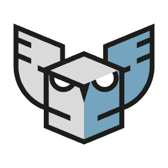

# State your goals
We need to know the F#, C++, C and Python langage, because we must translate C++ in F# via C and to writ in Python.

---
# Client
###### Who are they?

Our client for this project is Harfang 3D, a company that makes a 3D game engine. It's located in France since 2009.

# Product
###### Why they need of us for their project?
We must create a translater to C++ in F# and to take for exemple the translate program already write by FABGen. For us, the language Go is the one we took because this is the most similar to F#.

# Ecosystem
###### How will they use it and who will use it?
The product will be used by industrial companies but also by people wishing to use the Harfang 3D engine in F#. The product will of course also be used by the company Harfang 3D.

# Skills
###### What skills will you need in order to successfully complete this project?
Currently, FABGen's users can use FABGen to generate bindings for Python, Lua, and Go for Harfang 3D's engine. We will have to add F# bindings to this list. To do so, we will have to use three languages which are: C++, Python, and F#.

---
# Roadmap
## Organization
### Team work
###### How is the team organized to work together?
The team is organized with differents roles :

- Elise Gauthier is **Project Manager** : she must **organize the planning**, **give tasks** and **follow the progress** of the project.
- Rémy Charles is **Program Manager** : he must keep **contact with the client** (ask the questions, their requirements, communicate differents problem, etc) and he **write the Functional Specification**.
- Nicolas Mida is **Tech Leader** : he must **write the Technical Specification** thanks to the Functional Specification. He determined what languages, what logiciels and what technologies we use.
- Grégory Pagnoux is **Software Engineer** : he must **write the program** with the help of the Functional Specification and the Technical Specification. He must also correct the program after tests of the Quality Assurance.
- Théo Trouvé is **Quality Assurance** : he must **write the test** to testing the program of the SoftWare Engineer and he must **write the Test Plan** for keep each bug and error of the program.

### documentation saving and sharing system
###### ​How do you save and share your documentation?
The documentation is saved on the Github repository of the group project. The documentation is also shared, by email, in the form of a PDF file with the customer in order to have constructive feedback on the documents.

---
# Resources

| SOURCES | WHAT I LEARN ? |
| :-: | :-: |
| Web site to Harfang : https://www.harfang3d.com/en_US/ | Who are they and what do they do ? |
| Harfang 3D/FABGen github : https://github.com/harfang3d/algosup-binding-project | Understand the project, the code |
| Guide du langage F# : https://learn.microsoft.com/fr-fr/dotnet/fsharp/language-reference/ | Learn the F# vocabulary |
| Exercism : https://exercism.org/tracks/fsharp | Learn to use the F# |
| W3school : https://www.w3schools.com/html/default.asp | Learn the C and C++ |
| Download CMake : https://cmake.org/download/ | How install CMake |
| Documentation CMake : https://cmake.org/cmake/help/latest/manual/cmake.1.html | Learn the command of CMake |
